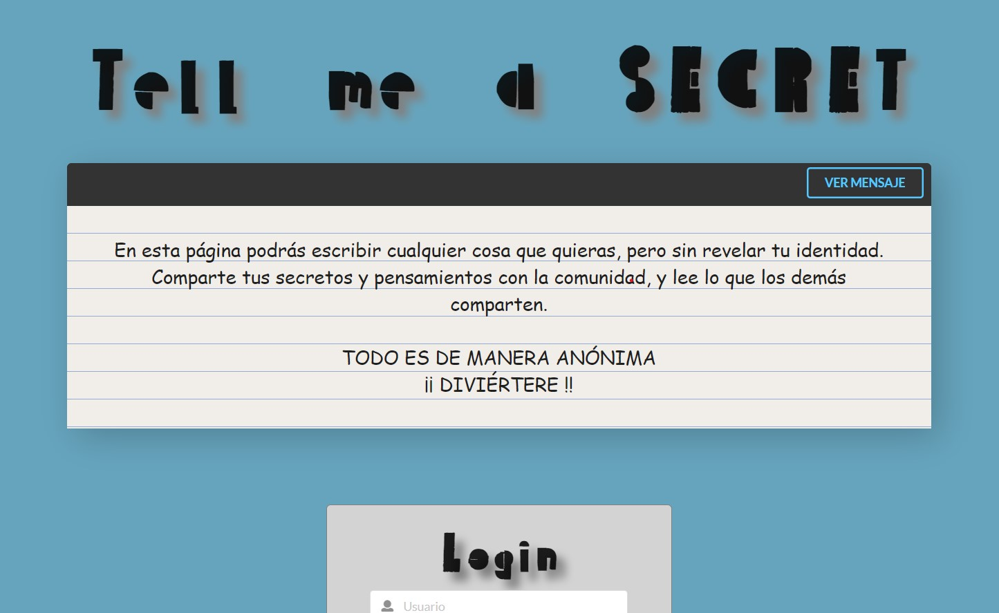

# Tell me a Secret

_Esta es una aplicación que permite a los usuarios publicar y leer mensajes de manera anónima_

------------

##  Funcionalidades 📄

La aplicación tiene las siguiente funcionalidades

* Login y registro de usuarios
* Ver de manera aleatoria mensajes que han publicado los usuarios
* Publicar mensajes
* Ver los mensajes que has publicado

## Tech Stack 🛠️

* [MongoDB](https://www.mongodb.com/es)
* [Prisma 1](https://v1.prisma.io/docs/1.34/)
* [Docker](https://www.docker.com/)
* [GraphQL](https://graphql.org/)
* [Apollo Server](https://www.apollographql.com/docs/apollo-server)
* [React]()

### Pre-requisitos 📋

Para la ejecución de la aplicación de manera local es necesario tener instalado:_

* [Node](https://nodejs.org/es/download/)
* [Yarn](https://classic.yarnpkg.com/en/docs/install/#windows-stable)
* [Docker](https://docs.docker.com/get-docker/)
* [Prisma1](https://v1.prisma.io/docs/1.34/prisma-cli-and-configuration/using-the-prisma-cli-alx4/)

### Ejecución 📦

El proyecto cuenta con dos carpetas backend y frontend. 
En el backend tenemos la API que nos va a permitir guardar y obtener la información que manejará la aplicación. En el frontend tenemos la interfaz creada en React para el consumo de la API.
Para ejecutar la aplicación de manera local es necesario tener instaladas lo mencionado en los pre-requisitos y seguir las siguientes instrucciones

* Para lanzar el servidor Prisma
	* Abrir un terminal donde se encuentra el archivo **docker-compose.yml (mensajesAnonimos/backend/database)** y ejecutar el siguiente comando para crear los contenedores de la base de datos MongoDB y Prisma
	
	`$ docker-compose up -d`
	* 
	Desplegar el código dentro de los servidores
	
	`$ prisma1 deploy`
	
	Subir datos de prueba a la base de datos
	
	`$ prisma1 seed`
	
	* Para comprobar que se encuentra funcionando puedes ir a **http://localhost:4466/_admin** . (Aquí visulizarás los registros cargados previamente)
	

* Para correr la API en Apollo Server
	* Abrir un terminal en  **mensajesAnonimos/backend/** y ejecutar el siguiente comando para descargar las dependencias necesarias
	
	`$ yarn install`
	
	Iniciar la API con
	
	`$ yarn dev`
	
	Para comprobar que la API funciona correctamente ir a **http://localhost:4000/**
	
* Para correr la interfaz
	* Abrir un terminal en  **mensajesAnonimos/frontend/** y ejecutar el siguiente comando para descargar las dependencias necesarias
	
	`$ yarn install`
	
	Iniciar la aplicacion
	
	`$ yarn start`
	
	Para comprobar que la API funciona correctamente ir a **http://localhost:3000/**
	

## Usando la aplicación 🚀
Al ingresar se muestra la pantalla de inicio, donde se tiene la posibilidad de:
* Ver mensajes publicados por los usuarios: Hacer click en el botón "VER MENSAJE" ubicado en la parte superior derecha de la nota de bienvenida. Hacer click trae un mensaje ramdom, hacer click nuevamente para leer otro mensaje y así sucesivamente.
* Login: En la parte inferior está un formulario que permite iniciar sesión. Llenar los datos y dar click en el botón "Ingresar". Esto recargará la página con datos adicionales. Si los datos son incorrectos mostrará el mensaje en la parte inferior del formulario.
Datos de usuario de prueba: 

	* Usuario: **usuarioPrueba**
	* Password: **u5M10**
	
* Registro de usuario: Dar click en la parte inferior del formulario de Login. Esto traerá el formulario de registro. Llenar los campos y dar click en el botón "Registrarse". Si el registro es exitoso enviará al formulario de login para que ingreses con el usuario que acabas de crear.

Una vez iniciada la sesión el usuario puede:
* Ver los mensajes de la misma manera explicada anteriormente
* Publicar un mensaje: bajo el espacio donde se visualizan los mensajes existe una caja de texto donde se puede escribir un mensaje y publicarlo al dar click en "Enviar mensaje"
* Ver mensajes publicados: debajo del espacio para publicar mensajes se listan los mensajes publicados por el usuario. 
* Cerrar sesión: En la parte superior de los mensajes del usuario hay un botón para cerrar la sesión y volver a la página de inicio.

## Autor ✒️

 **María Guadalupe Hernández Gutiérrez** 